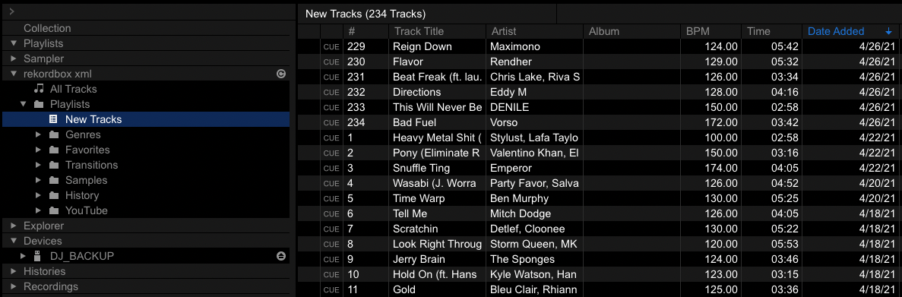

# DJ Tools

## Overview of Tools:
* `clone_library.py`: download / upload MP3s, download `rekordbox.xml`
* `download.sh`: download track(s) by URL via youtube-dl (Soundcloud)
* `rename.py`: rename ugly files downloaded with the `download.sh` script
* `randomize_tracks.py`: randomize track number (and other select ID3 tag fields) to 'shuffle' library
* `key_analysis.py`: analyze / visualize melodic key information in library

## Cloning Library
----------

### Description:
This script can download from / upload to an AWS S3 instance which stores all the MP3s of the track collection. In addition, it can download a `rekordbox.xml` file which can be used to selectively import Rekordbox data (beatgrid and cue information) for tracks and/or playlists.
### Prerequisites:
* `awscli`
    - Mac installation: `brew install awscli`
    - Linux installation: `sudo apt-get install awscli`
    - Windows installation: [you're on your own](https://docs.aws.amazon.com/cli/latest/userguide/install-cliv2-windows.html#cliv2-windows-install)
* `python3`

### Configuring `awscli`:
In your terminal run the following command to configure `awscli` for access to the AWS S3 instance:

`aws configure --profile DJ`

Enter the provided `access_key` and `secret_key`. Default values for the rest of the configuration is fine.

### Usage:
```
usage: clone_library.py [-h] [--path PATH]
                        [--download {music,xml} [{music,xml} ...]] [--upload]

optional arguments:
  -h, --help            show this help message and exit
  --path PATH, -p PATH  path to root of DJ USB
  --download {music,xml} [{music,xml} ...], -d {music,xml} [{music,xml} ...]
                        download MP3s and/or rekordbox.xml
  --upload, -u          upload MP3s
```

### Examples:
Download all new music and most up-to-date `rekordbox.xml`:

`python3 clone_library.py --path /Volumes/DJ/ --download music xml`

Upload all new music:

`python3 clone_library.py --path /Volumes/DJ/ --upload`

### Importing Music From `rekordbox.xml`:
Ensure you have the proper `rekordbox.xml` file selected under Preferences > Advanced > Database > rekordbox xml:


Also make sure you have made the `rekordbox.xml` database visible under Preferences > View > Layout > rekordbox xml:


Then select the track(s) or playlist(s) and select "Import To Collection" (this will overwrite beatgrid and cue information for files with the same name!):


For convenience, there's a playlist called `New Tracks` which can be referenced to find the most recent additions to the collection; don't forget to include the `Date Added` column by right-clicking the column headers area:


### Future Work:
* convert `rekordbox.xml` into Serato compatible beatgrid and cue data -- for the time being, you might have success with [this tool](https://github.com/digital-dj-tools/dj-data-converter); I've used this in the past to convert from Traktor to Rekordbox, though I did have to use search & replace to fix broken file paths