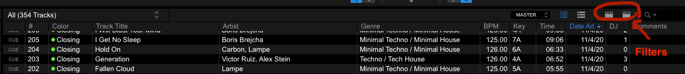

# DJ Tools
## Overview of Tools:
* `clone_library.py`: download / upload MP3s, download `rekordbox.xml`
* `download.sh`: download track(s) by URL via youtube-dl (Soundcloud)
* `rename.py`: rename ugly files downloaded with the `download.sh` script
* `randomize_tracks.py`: randomize track number (and other select ID3 tag fields) to 'shuffle' library
* `key_analysis.py`: analyze / visualize melodic key information in library
* `spotify_analysis.py`: compare Spotify playlists with each other and local folders to identify overlapping or missing tracks 
----------
## Cloning Library
### Description:
This script can download from / upload to an AWS S3 instance which stores all the MP3s of the track collection. In addition, it can download a `rekordbox.xml` file which can be used to selectively import Rekordbox data (beatgrid and cue information) for tracks and/or playlists.
### Prerequisites:
* `python3`
    - Mac installation: `brew install python`
    - Linux installation: `sudo apt install python3.8`
    - Windows installation: [Windows releases](https://www.python.org/downloads/windows/) or [3.9.4 installer](https://www.python.org/ftp/python/3.9.4/python-3.9.4-amd64.exe)
* `awscli`
    - Mac installation: `brew install awscli`
    - Linux installation: `sudo apt-get install awscli`
    - Windows installation [[official instructions](https://docs.aws.amazon.com/cli/latest/userguide/install-cliv2-windows.html)]: [download installer](https://awscli.amazonaws.com/AWSCLIV2.msi) OR run `msiexec.exe /i https://awscli.amazonaws.com/AWSCLIV2.msi`
### Configuring `awscli`:
In your terminal run the following command to configure `awscli` for access to the AWS S3 instance:

&nbsp;&nbsp;&nbsp;&nbsp;&nbsp;&nbsp;&nbsp;&nbsp;&nbsp;&nbsp; `aws configure --profile DJ`

Enter the provided `access_key` and `secret_key`. Default values for the rest of the configuration is fine.

### Usage:
```
usage: clone_library.py [-h] --path PATH
                        [--download {music,xml} [{music,xml} ...]]
                        [--upload {music,xml} [{music,xml} ...]] [--delete]
                        [--include INCLUDE [INCLUDE ...]]
                        [--exclude EXCLUDE [EXCLUDE ...]]
                        [--use_date_modified]

optional arguments:
  -h, --help            show this help message and exit
  --path PATH, -p PATH  path to root of DJ USB
  --download {music,xml} [{music,xml} ...], -d {music,xml} [{music,xml} ...]
                        download MP3s and/or rekordbox.xml
  --upload {music,xml} [{music,xml} ...], -u {music,xml} [{music,xml} ...]
                        upload MP3s and/or rekordbox.xml
  --delete              adds --delete flag to "aws s3 sync" command (only for
                        me)
  --include INCLUDE [INCLUDE ...]
                        --include flag for each top-level folder in "DJ Music"
  --exclude EXCLUDE [EXCLUDE ...]
                        --exclude flag for each top-level folder in "DJ Music"
  --use_date_modified   drop --size-only flag for `aws s3 sync` command
```

### Usage Flow Chart:


### Examples (Windows users should use a `--path` like `D:`):
🟢 Download mp3 files only:

&nbsp;&nbsp;&nbsp;&nbsp;&nbsp;&nbsp;&nbsp;&nbsp;&nbsp;&nbsp; `python clone_library.py --path /path/to/USB --download music`

🟢 Only download contents of `Techno` folder:

&nbsp;&nbsp;&nbsp;&nbsp;&nbsp;&nbsp;&nbsp;&nbsp;&nbsp;&nbsp; `python clone_library.py --path /path/to/USB --download music --include Techno`

🟢 Ignore contents of `Bass` and `Other` folders :

&nbsp;&nbsp;&nbsp;&nbsp;&nbsp;&nbsp;&nbsp;&nbsp;&nbsp;&nbsp; `python clone_library.py --path /path/to/USB --download music --exclude Bass Other`

🔵 Redownload mp3 files with updated ID3 tags:

&nbsp;&nbsp;&nbsp;&nbsp;&nbsp;&nbsp;&nbsp;&nbsp;&nbsp;&nbsp; `python clone_library.py --path /path/to/USB --download music --use_date_modified`

🔴 Download mp3 files and my `rekordbox.xml` which can be imported from:

&nbsp;&nbsp;&nbsp;&nbsp;&nbsp;&nbsp;&nbsp;&nbsp;&nbsp;&nbsp; `python clone_library.py --path /path/to/USB --download music xml`

⚪ Upload all new music (not tested with Windows):

&nbsp;&nbsp;&nbsp;&nbsp;&nbsp;&nbsp;&nbsp;&nbsp;&nbsp;&nbsp; `python3 clone_library.py --path /path/to/USB --upload music`

-------------
### Importing Music From `rekordbox.xml`:
Ensure you have the proper `rekordbox.xml` file selected under Preferences > Advanced > Database > rekordbox xml:


Also make sure you have made the `rekordbox.xml` database visible under Preferences > View > Layout > rekordbox xml:


Then select the track(s) or playlist(s) and select "Import To Collection" (this will overwrite beatgrid and cue information for files with the same name!):

For convenience, there's a folder called `New Tracks` which can be referenced to find the most recent additions to the collection. Playlists are organized both anually and by the date of the upload session.


Don't forget to include the `Date Added` and `Color` columns by right-clicking the column headers area; sort by `Date Added` and import the most recent tracks you haven't imported yourself yet.

This is my column header arrangement. The ID3 and rekordbox tag filters are circled in red; try them out for quick playlist building.


When I process a track, I set the `Color` to `green (Closing)` as a default. As I mix (or if it's immediately apparent while importing) I may set `Color` to `red (Headline)` or `blue (Opening)` if a track has too much or too little energy, respectively, to sustain a groove. Additionally I may set `Color` to `yellow (WARNING)` if the track was not able to be processed or is otherwise deemds unmixable or at least a risky mix.

**NOTE:** The usage of `red` and `blue` in this color scheme is largely neglected; basically you should use color as an indicator of whether or not a track has been processed.

**NOTE ABOUT BACKING UP YOUR DATA:**

There may be mp3 files available for tracks that I haven't processed yet; this means importing from the `rekordbox.xml` is will effectively be the same as importing from the `Explorer`. You may either import and process the tracks yourself (set BPM, beat grid, hot cues) or wait until I push a more up-to-date `rekordbox.xml` and import the tracks at that time.

If you want to retain your custom bpm, beatgrid, and hot cue data, you **must not** reimport that track, or any playlist containing that track, from my `rekordbox.xml` once you've made the changes on your local file system.

If you want to retain your custom ID3 tag field modifications (artist(s), track name, genre(s), comments), you **must not** run `clone_library.py` with the `--use_date_modified` flag. Alternatively, you may run with the `--use_date_modified` flag and additionally use either the `--include` or the `--exclude` option to prevent redownloading contents of folders containing the tracks you want to preserve.

You may want to consider keeping a regular backup of your rekordbox library data in a file called `my_rekordbox.xml` so you can restore data for tracks and playlists in the event they are overwritten or otherwise lost.

-------------
### Roadmap:

- Update ID3 tag field for `Genre`
    * [x] Bass > Favorites
    * [ ] House > Favorites
    * [ ] Bass > All 
    * [ ] House > All 
    * [x] Techno > All 
    * [x] `New Tracks` after `2021-04-28`
    * [ ] `New Tracks` after `2020`
    * [ ] `Collection`
- Update hot cue scheme
    * [x] Bass > Favorites 
    * [ ] Bass > All
    * [x] House > All
    * [x] Techno > All