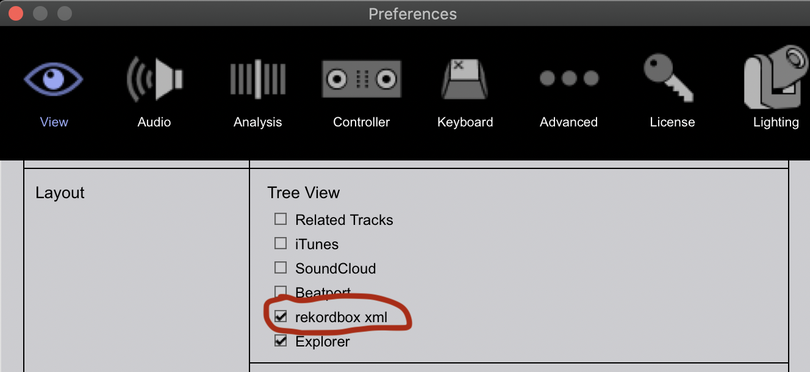
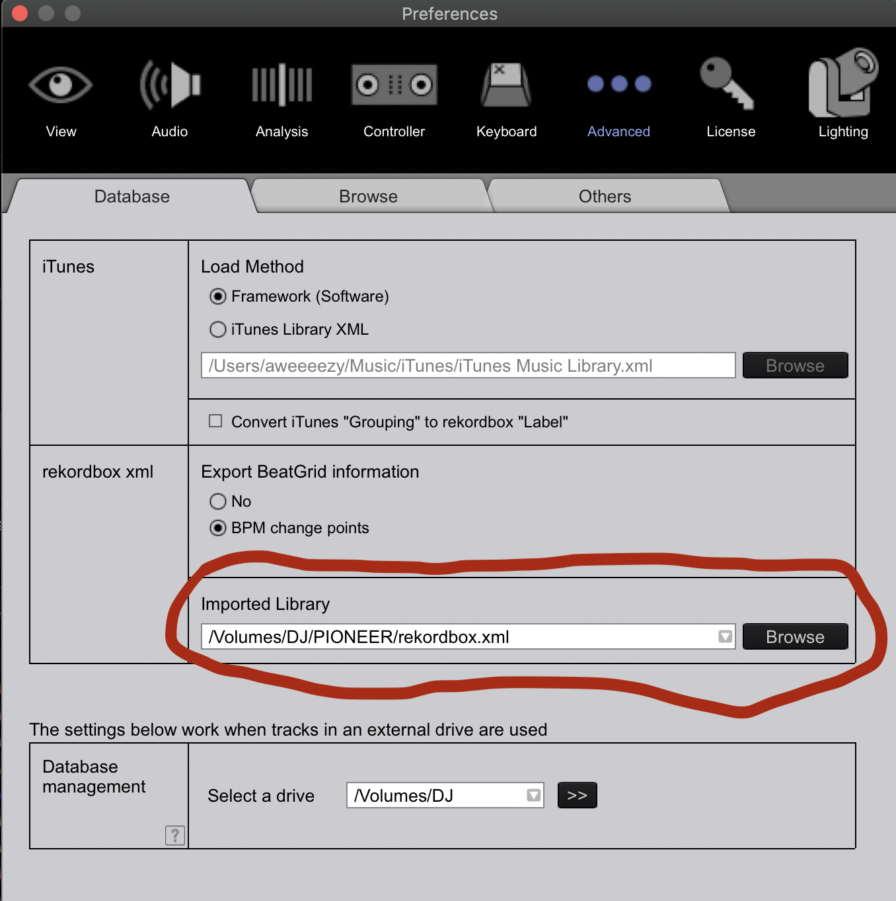

# DJ Tools

## Contents
* Overview
* Setup
    - Python
    - AWS
* Usage
* Basic Information 
    - Preliminary
        * Music files
        * Rekordbox XML
    - Importing tracks from Explorer
    - Setting beatgrid and hot cues
    - Importing tracks from XML
    - Reloading tags
    - Exporting to a Device

# Overview
`DJ Tools` is a library for managing a collection of audio files (not necessarily mp3 files, although that is preferred) and Rekordbox XML files. To take full advantage of this library, users must:
* have access to an AWS S3 instance (the `beatcloud`) and have the `awscli` client installed
* be a Rekordbox user
* keep your music collection and Rekordbox database on a USB drive (why wouldn't you?)
* utilize the genre ID3 / Rekordbox tag of the music files in your collection
* have a Spotify account

The core functionality of this library can be broken up into three components or packages:
1. `sync`: allows users to push and pull audio and rekordbox XML files to and from the `beatcloud`
2. `spotify`: allows users to:
    * compare the tracks of one or more Spotify playlists against the `beatcloud` (to identify redundancies)
    * update Spotify playlists using the top posts of subreddits
3. `utils`: contains of variety of utilities for things such as: 
    * generating an XML with playlists based on the genre tags of your Collection
    * analyzing the genre tags directly from your local mp3 files
    * emulating a playlist randomization feature which is strangely absent from Rekordbox
    * downloading mp3 files from a URL (e.g. Soundcloud...don't use YouTube because that's some highly compressed garbage)

For usage details relating to the individual packages of `DJ Tools`, checkout the README files that are collocated with those packages (under the `src` folder).

# Setup

## Python
The `DJ Tools` library uses f-strings so a minimum version of Python 3.6 is required. As always, when working with a Python project, you're going to want to create a virtual environment. [Pyenv](https://github.com/pyenv/pyenv) is really nice, but if you insist on doing a system-wide python installation then proceed with the following instructions: 
* Mac installation: `brew install python@3.6`
* Linux installation: `sudo apt install python3.6`
* Windows installation: [Windows releases](https://www.python.org/downloads/windows/) or [3.6.0 installer](https://www.python.org/ftp/python/3.6.0/python-3.6.0.exe)

Run `python3 -m pip install requirements.txt` to install the required packages.
## AWS
Next you will need to install `awscli`:
* Mac installation: `brew install awscli`
* Linux installation: `sudo apt-get install awscli`
* Windows installation [[official instructions](https://docs.aws.amazon.com/cli/latest/userguide/install-cliv2-windows.html)]: [download installer](https://awscli.amazonaws.com/AWSCLIV2.msi) OR run:

      `msiexec.exe /i https://awscli.amazonaws.com/AWSCLIV2.msi`

Now you can configure `awscli` to access your instance of the `beatcloud`:

      `aws configure --profile DJ`

Enter the `access_key` and `secret_key`. Default values for the rest of the configuration is fine.

# Usage
`DJ Tools` contains quite a bit of functionality, but all of it is configurable via a required JSON file called `config.json` (located in the `config` folder). The presence of all 39 configuration options is required for operation, though not all the values need to be populated; it's recommended that you copy the `CONFIG_TEMPLATE` from `config.py` and modify it as necessary to suit your needs. You may also copy the example `config.json` below.

All configuration options may be overridden via command-line arguments of the same name. Example:
      `python3 dj_tools.py --usb_path /path/to/usb/`

### Example `config.json`:
```
{
    "USB_PATH": "/Volumes/My_DJ_USB/",
    "AWS_PROFILE": "DJ",
    "UPLOAD_INCLUDE_DIRS": [],
    "UPLOAD_EXCLUDE_DIRS": ["New Music"],
    "DOWNLOAD_INCLUDE_DIRS": [],
    "DOWNLOAD_EXCLUDE_DIRS": [],
    "AWS_USE_DATE_MODIFIED": false,
    "XML_IMPORT_USER": "myfriend",
    "XML_PATH": "/path/to/xmls/my_rekordbox.xml",
    "USER": "",
    "DISCORD_URL": "https://discord.com/api/webhooks/some/url",
    "YOUTUBE_DL": false,
    "YOUTUBE_DL_URL": "https://soundcloud.com/me/sets/to-download",
    "RANDOMIZE_TRACKS": false,
    "RANDOMIZE_TRACKS_PLAYLISTS": ["Halftime", "Trip Hop"],
    "RANDOMIZE_TRACKS_TAG": "track_num",
    "SYNC_OPERATIONS": ["download_music", "download_xml"],
    "GET_GENRES": false,
    "GENRE_EXCLUDE_DIRS": [],
    "GENRE_TAG_DELIMITER": "/",
    "GENERATE_GENRE_PLAYLISTS": true,
    "GENERATE_GENRE_PLAYLISTS_REMAINDER": "folder",
    "SPOTIFY_CHECK_PLAYLISTS": false,
    "SPOTIFY_PLAYLISTS_CHECK": ["Download", "Maybe Download"],
    "SPOTIFY_PLAYLISTS_CHECK_FUZZ_RATIO": 80,
    "SPOTIFY_CLIENT_ID": "",
    "SPOTIFY_CLIENT_SECRET": "",
    "SPOTIFY_REDIRECT_URI": "",
    "SPOTIFY_USERNAME": "",
    "AUTO_PLAYLIST_UPDATE": false,
    "AUTO_PLAYLIST_SUBREDDITS": ["HalftimeDnB", "spacebass"],
    "AUTO_PLAYLIST_TRACK_LIMIT": 50,
    "AUTO_PLAYLIST_TOP_PERIOD": "week",
    "AUTO_PLAYLIST_FUZZ_RATIO": 50,
    "REDDIT_CLIENT_ID": "",
    "REDDIT_CLIENT_SECRET": "",
    "REDDIT_USER_AGENT": "",
    "VERBOSITY": 0,
    "LOG_LEVEL": "INFO"
}
```

* `USB_PATH`: the full path to the USB drive which contains all your music files
* `AWS_PROFILE`: the name of the profile used when running `aws configure --profile`
* `UPLOAD_INCLUDE_DIRS`: the list of paths to folders (relative to the `DJ Music` folder on your `USB_PATH`) that should exclusively be uploaded to the `beatcloud` when running the `upload_music` sync operation
* `UPLOAD_EXCLUDE_DIRS`: the list of paths to folders (relative to the `DJ Music` folder on your `USB_PATH`) that should NOT be uploaded to the `beatcloud` when running the `upload_music` sync operation
* `DOWNLOAD_INCLUDE_DIRS`: the list of paths to folders (relative to the `DJ Music` folder on your `USB_PATH`) that should exclusively be downloaded from the `beatcloud` when running the `download_music` sync operation
* `DOWNLOAD_EXCLUDE_DIRS`: the list of paths to folders (relative to the `DJ Music` folder on your `USB_PATH`) that should NOT be downloaded from the `beatcloud` when running the `download_music` sync operation
* `AWS_USE_DATE_MODIFIED`: up/download files that already exist at the destination if the date modified field at the source is after that of the destination (i.e. the ID3 tags have been changed)...BE SURE THAT ALL USERS OF THIS `BEATCLOUD` INSTANCE ARE ON BOARD BEFORE UPLOADING WITH THIS FLAG SET!
* `XML_IMPORT_USER`: the username of a fellow `beatcloud` user (as present in `registered_users.json`) from whose Rekordbox XML you are importing tracks
* `XML_PATH`: the full path to your Rekordbox XML file which should contain an up-to-date export of your Collection...the directory where this points to is also where all other XMLs generated or utilized by this library will exist
* `USER`: this is the username that will be entered into `registered_users.json`...if left as an empty string, then your operating system username will be used...it's recommended that you only override this if your username changes from what other users of your `beatcloud` instance are expecting (to ensure consistency)
* `DISCORD_URL`: webhook URL for messaging a Discord server's channel when new music has been uploaded to the `beatcloud`
* `YOUTUBE_DL`: boolean flag to trigger the downloading of files from `YOUTUBE_DL_URL` into the `DJ Music` -> `New Music` folder on your `USB_PATH`
* `YOUTUBE_DL_URL`: URL from which music files should be downloaded (i.e. a Soundcloud playlist)
* `RANDOMIZE_TRACKS`: boolean flag to trigger the emulated playlist shuffling feature on each playlist in `RANDOMIZE_TRACKS_PLAYLISTS`
* `RANDOMIZE_TRACKS_PLAYLISTS`: list of playlist names (must exist in `XML_PATH`) that should have their tracks shuffled
* `RANDOMIZE_TRACKS_TAG`: ID3 tag (must be acknowledged by the `eyed3` package) which is overwritten to emulate playlist shuffling (it's recommended that you leave this as `track_num`)
* `SYNC_OPERATIONS`: list of sync operations to run in order -- choices: {`download_music`, `download_xml`, `upload_music`, `upload_xml`}
* `GET_GENRES`: boolean flag to trigger an analysis of the genre ID3 tags of your local mp3 files (prints the number of tracks in alphabetized genres...increasing `VERBOSITY` prints tracks in each genre)
* `GENRE_EXCLUDE_DIRS`: list of partial paths (folders) which cannot appear in full paths of mp3 files when considering their genre ID3 tags
* `GENRE_TAG_DELIMITER`: character to use for splitting a track's genre ID3 tag when tag contains multiple genres (e.g. "/")
* `GENERATE_GENRE_PLAYLISTS`: boolean flag to trigger the generation of a playlist structure (as informed by `generate_genre_playlists.json`) using the genre tags in `XML_PATH`...the resulting XML file is `XML_PATH` prefixed with "`auto_`"
* `GENERATE_GENRE_PLAYLISTS_REMAINDER`: whether tracks of remainder genres (those not specified in `generate_genre_playlists.json`) will be placed in a `folder` called "Other" with individual genre playlists or a `playlist` called "Other"
* `SPOTIFY_CHECK_PLAYLISTS`: boolean flag to trigger checking the contents of Spotify playlists specified in `SPOTIFY_PLAYLISTS_CHECK` against the `beatcloud` (to identify redundancies)
* `SPOTIFY_PLAYLISTS_CHECK`: list of Spotify playlists to use with `SPOTIFY_CHECK_PLAYLISTS`
* `SPOTIFY_PLAYLISTS_CHECK_FUZZ_RATIO`: the minimum Levenshtein similarity for indicating potential redundancies between Spotify playlists and the `beatcloud`
* `SPOTIFY_CLIENT_ID`: client ID for registered Spotify API application
* `SPOTIFY_CLIENT_SECRET`: client secret for registered Spotify API application
* `SPOTIFY_REDIRECT_URI`: redirect URI for registered Spotify API application
* `AUTO_PLAYLIST_UPDATE`: boolean flag to trigger the automatic generation or updating of Spotify playlists from subreddits
* `SPOTIFY_USERNAME`: Spotify username that will keep playlists automatically generated
* `AUTO_PLAYLIST_SUBREDDITS`: list of subreddits from which tracks should be added to Spotify auto-playlist
* `AUTO_PLAYLIST_TRACK_LIMIT`: maximum length of Spotify auto-playlist before oldest tracks are removed
* `AUTO_PLAYLIST_TOP_PERIOD`: time period to query subreddit top posts over -- choices: {`hour`, `day`, `week`, `month`, `year`, `all`}
* `AUTO_PLAYLIST_FUZZ_RATIO`: the minimum Levenshtein similarity between a Spotify API track search result and a subreddit post title (if post is not directly a Spotify URL) to trigger the addition of that track to the corresponding Spotify auto-playlist
* `REDDIT_CLIENT_ID`: client ID for registered Reddit API application
* `REDDIT_CLIENT_SECRET`: client secret for registered Reddit API application
* `REDDIT_USER_AGENT`: user-agent for registered Reddit API application
* `VERBOSITY`: verbosity level for logging messages
* `LOG_LEVEL`: logger log level

# Basic Information
If you are an advanced Rekordbox user, then the following section is likely not for you. If you are not an advanced Rekordbox user, or are interested in the workflow patterns that accompany this library, read on!

## Preliminary

### Music files
The music files in your collection _should_ be in the MP3 format. There are a couple reasons for this:
1. MP3 files are very compact meaning you can fit more music on your USB, pay less for cloud storage, and enjoy faster upload / download times
2. MP3 files have metadata fields called ID3 tags which couple information like track, title, artist, comment, genres, etc. with the file itself; other formats (AIFF or WAV) _may_ include implementations of ID3 but this library has not been tested with these

It's true that MP3 is lossy, meaning it's _possible_ for MP3 files to produce lower quality audio than, say, FLAC files, but [research](https://www.researchgate.net/publication/257068576_Subjective_Evaluation_of_MP3_Compression_for_Different_Musical_Genres) (see [Nyquist–Shannon sampling theorem](https://en.wikipedia.org/wiki/Nyquist%E2%80%93Shannon_sampling_theorem)) shows that even the most trained ears of audiophiles cannot distinguish any difference between lossless audio and 256 kbps MP3 audio. There _are_ arguments that support using a sample rate higher than the theoretical minimum for human hearing (44.1 kHz); digital-to-analog conversion (as is performed in a speaker cone) is necessarily a non-linear system which can produce audible distortions from previously inaudible frequencies. Since my audio processing facilities support the highest quality bitrate for MP3 files, and the size of these files is negligibly larger, I use 320 kbps files.

`NOTE`: all files must follow this naming convention:

      `Title (Artist2 Remix) - Artist1, Artist2.mp3`

`NOTE`: before importing tracks for the first time, it's _highly_ recommended that you use MP3 tagging software (e.g. [Mp3tag](https://www.mp3tag.de/en/) or [Picard](https://picard.musicbrainz.org/)) to extract title and artist tags from the file names automatically

`NOTE`: it's also _highly_ recommended that you use Mixed In Key to do your melodic key analysis. Mixed In Key is the most accurate key analysis software out there and is _much_ better than Rekordbox's key analysis. Make sure you turn off `KEY` under `Preferences > Analysis > Track Analysis Setting`.


---

### Rekordbox XML
Your Rekordbox Collection includes all the data associated with individual tracks as well playlist data. Your Collection can be exported to an XML file using `File > Export Collection in xml format`. The resulting file can be used to restore your Collection if it's ever lost or messed up. It's recommended that you make frequent backups of your Collection.

Because all track information is stored in the XML and tracks can be imported to a Collection from an XML, it's possible for multiple users to benefit from the efforts of another user who processes tracks in a shared Collection. For example, users `A` and `B` can both contribute audio files to the `beatcloud` while only user `A` prepares beatgrids, hot cues, genre tags, and playlists. After user `A` completes this work, exports an XML, and uploads said XML to the `beatcloud`, user `B` can then download that XML and use it to import tracks into their Collection _with_ all the data that user `A` generated.

---

## Importing tracks from Explorer
If you are importing unprocessed tracks for the first time, or you simply don't want to import other users' track data, then you will import tracks from the `Explorer` tree view (make sure it's set to visible under `Preferences > View > Layout`; see the image below). Upon importing, Rekordbox will perform an analysis which will attempt to set the beatgrid. Often times this is incorrect, so make sure you confirm it's correct before considering the track fully imported.

---

## Setting beatgrid and hot cues
A track's beatgrid is a set of data points which define the beats-per-minute (BPM) of a track and also, in the case of a dynamic beatgrid, define points where the BPM changes. Dynamic beatgrids are particularly handy for tracks that have one or more BPM changes but are otherwise BPM stable (the track is quantized or recorded to a metronome). Setting a dynamic beatgrid for tracks with unstable BPMs is often more effort than it's worth and generally produces, at best, a track that gives the illusion of being easy to mix while, in practice, this is not the case.

When importing a track, there are several beatgrid-related states that the built-in analysis may produce (in order of correctness):
1. BPM is correct and beatgrid is aligned correctly
2. BPM is correct but beatgrid is misaligned (requires a simple shift)
3. BPM is incorrect (often requires alternating between BPM adjustements and beatgrid shifts)
4. track has severely unstable BPM (I generally forgo setting the beatgrid, turn off quantization, and set my hot cues as desired)

Once the beatgrid is established, I will apply a standardized hot cue schema so that I can reliably mix any track in my library, even if it's quite old and I've forgotten its nuances. Below is a description of the schema that I personally use for all my tracks:

* `A` and `B`: beat on which a break or build starts (in chronological order) 
* `C`: "best" downbeat to begin a mix on (not too high energy, but definitely a prominent downbeat)
* `D`, `G`, `H`: chronologically successive "drops" of the track (generally following a break / build)
* `E`: the very first sound of the track (not necessarily a downbeat)
* `F`: warning flag that the track is close to finishing or approaching a significant dropoff in energy (usually 8 bars before said dropoff / end)

---

## Importing tracks from XML
Make sure you have made the `rekordbox.xml` database visible under `Preferences > View > Layout`:



Also ensure you have the proper XML file selected under `Preferences > Advanced > Database > rekordbox xml`:



Then select the track(s), playlist(s), or folder(s) and choose "Import To Collection" or "Import Playlist"; this will overwrite playlists, beatgrids, hot cues, and Rekordbox Tags for files / playlists / folders with the same name!


---

## Reloading tags
If you are modifying ID3 tags (e.g. using `DJ Tools` playlist randomization feature), then you will need to reload the tags from Rekordbox to acknowledge those changes (`select one or more tracks > right-click > Reload Tags`).


If you are redownloading tracks with new genre tags (i.e. using `AWS_USE_DATE_MODIFIED`) reloading tags does not work for updating the genre tags...for Rekordbox to acknowledge those specific changes, you must reimport the tracks to your collection.

---

## Exporting to a Device
Exporting to a Device is necessary if you want to have access to your Collection on CDJ hardware or another Rekordbox user's laptop (if any USB, besides your own, is set as the Database `Preferences > Advanced > Database > Database management`). You can export your entire Playlists tree tab (as shown in this image) or any folders / playlists you select inside the Playlists tree tab by right-clicking the playlist / folder.


