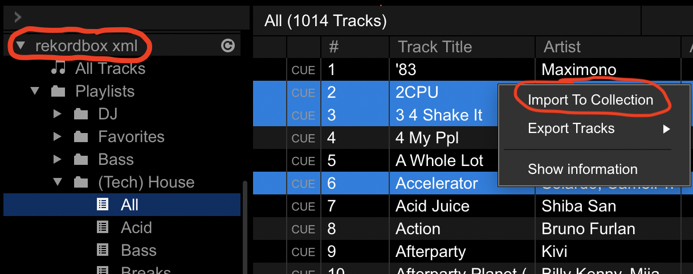

# DJ Tools

## Overview of Tools:
* `clone_library.py`: download / upload MP3s, download `rekordbox.xml`
* `download.sh`: download track(s) by URL via youtube-dl (Soundcloud)
* `rename.py`: rename ugly files downloaded with the `download.sh` script
* `randomize_tracks.py`: randomize track number (and other select ID3 tag fields) to 'shuffle' library
* `key_analysis.py`: analyze / visualize melodic key information in library
* `spotify_analysis.py`: compare Spotify playlists with each other and local folders to identify overlapping or missing tracks 

## Cloning Library
----------

### Description:
This script can download from / upload to an AWS S3 instance which stores all the MP3s of the track collection. In addition, it can download a `rekordbox.xml` file which can be used to selectively import Rekordbox data (beatgrid and cue information) for tracks and/or playlists.
### Prerequisites:
* `python3`
    - Mac installation: `brew install python`
    - Linux installation: `sudo apt install python3.8`
    - Windows installation: [Windows releases](https://www.python.org/downloads/windows/) or [3.9.4 installer](https://www.python.org/ftp/python/3.9.4/python-3.9.4-amd64.exe)
* `awscli`
    - Mac installation: `brew install awscli`
    - Linux installation: `sudo apt-get install awscli`
    - Windows installation [[official instructions](https://docs.aws.amazon.com/cli/latest/userguide/install-cliv2-windows.html)]: [download installer](https://awscli.amazonaws.com/AWSCLIV2.msi) OR run `msiexec.exe /i https://awscli.amazonaws.com/AWSCLIV2.msi`

-------------
### Configuring `awscli`:
In your terminal run the following command to configure `awscli` for access to the AWS S3 instance:

`aws configure --profile DJ`

Enter the provided `access_key` and `secret_key`. Default values for the rest of the configuration is fine.

-------------

### Usage:
```
usage: clone_library.py [-h] [--path PATH]
                        [--download {music,xml} [{music,xml} ...]] [--upload]

optional arguments:
  -h, --help            show this help message and exit
  --path PATH, -p PATH  path to root of DJ USB
  --download {music,xml} [{music,xml} ...], -d {music,xml} [{music,xml} ...]
                        download MP3s and/or rekordbox.xml
  --upload, -u          upload MP3s
```

### Examples:
Download all new music and most up-to-date `rekordbox.xml`:

[Unix] `python3 clone_library.py --path /Volumes/DJ/ --download music xml`

[Windows] `python3 clone_library.py --path D: --download music xml`

Upload all new music (not tested with Windows):

`python3 clone_library.py --path /Volumes/DJ/ --upload`

-------------

### Importing Music From `rekordbox.xml`:
Ensure you have the proper `rekordbox.xml` file selected under Preferences > Advanced > Database > rekordbox xml:


Also make sure you have made the `rekordbox.xml` database visible under Preferences > View > Layout > rekordbox xml:


Then select the track(s) or playlist(s) and select "Import To Collection" (this will overwrite beatgrid and cue information for files with the same name!):


For convenience, there's a playlist called `New Tracks` which can be referenced to find the most recent additions to the collection.

Don't forget to include the `Date Added` and `Color` columns by right-clicking the column headers area; sort by `Date Added` and import the most recent tracks you haven't imported yourself yet. When I process a track (adjust beatgrid & tempo and set cue points), I set the `Color` to `green (Closing)`.

As I mix (or if it's immediately apparent while importing) I may set `Color` to `red (Headline)` if it's a track with a bit too much energy to play with more than one other `red` track in a row.

I may also set `Color` to `blue (Opening)` if a track has too little energy to sustain a groove.

-------------

**NOTE:** This color scheme is largely neglected; basically you should use color as an indicator of whether or not a track has been processed.

-------------

**NOTE:** There may be an mp3 available for a track that I haven't processed; meaning you can import the track (assign BPM, beat grid) and begin storing custom cue points in addition to making potentially necessary beatgrid adjustement(s). You may want to consider re-importing these tracks again after I've processed them so you can persist consistency with my library. Otherwise, if you want to retain your own custom adaptations to the tracks, as far as Rekordbox is concerned, then ensure you **do not** re-import my `rekordbox.xml` representation of a track ontop of your own...always keep an up-to-date `my_rekordbox.xml` that you can restore / import from in case you overwrite tracks with my Rekordbox info

-------------


-------------
### Future Work:
* convert `rekordbox.xml` into Serato compatible beatgrid and cue data -- for the time being, you might have success with [this tool](https://github.com/digital-dj-tools/dj-data-converter); I've used this in the past to convert from Traktor to Rekordbox, though I did have to use search & replace to fix broken file paths