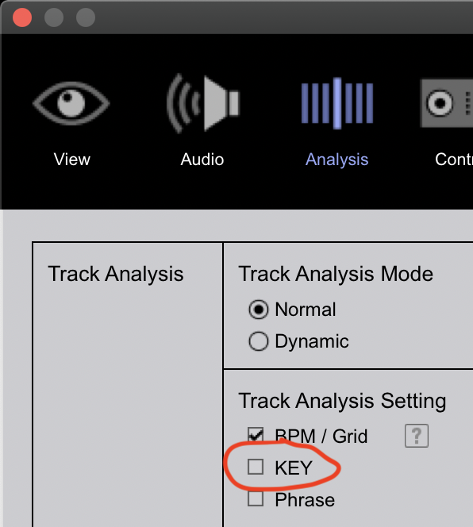

# Audio File Standardization & Quality Control
## Audio file format
The music files in your Collection _should_ be in the MP3 format. There are a couple reasons for this:

1. MP3 files are very compact meaning you can fit more music on your USB, pay less for cloud storage, and enjoy faster sync times
1. Having smaller files also means faster loading times on CDJs / XDJs which are notoriously slow
1. MP3 files have metadata fields called ID3 tags which couple information like track, title, artist, comment, genres, etc. with the file itself; other formats (AIFF or WAV) _may_ include ID3 specifications

It's true that MP3 is lossy, meaning it's _possible_ for MP3 files to produce lower quality audio than, say, FLAC files, but [research](https://www.researchgate.net/publication/257068576_Subjective_Evaluation_of_MP3_Compression_for_Different_Musical_Genres) (see [Nyquist–Shannon sampling theorem](https://en.wikipedia.org/wiki/Nyquist%E2%80%93Shannon_sampling_theorem)) shows that even the most trained ears of audiophiles cannot distinguish any difference between lossless audio and 256 kbps MP3 audio.

There _are_ arguments that support using a sample rate higher than the theoretical minimum for human hearing (44.1 kHz); digital-to-analog conversion (as is performed in a speaker cone) is necessarily a non-linear system which can produce audible distortions from previously inaudible frequencies. However, if you use 320 kbps MP3s instead of FLACs on even the most advanced audio systems, nobody will be able to tell the difference.

## Filenames
The characters you use in the filenames added to the Beatcloud _does_ matter; while Unix systems are very tolerant of filenames, Windows systems are comparably very sensitive. Windows explicitly lists these characters as forbidden: `<`, `>`, `:`, `"`, `/`, `\`, `|`, `?`, `*`, `%`, `?`

Futher more, files stored in S3 may not interact properly with the protocols that may be used to sync them if they contain particular characters. I cannot speak to character-related compatibility issues with other object-storage solutions.

I'm advocating that the character set matched by this regex expression be the whitelist of characters for filenames:

```
In [2]: string = "Track_Title (Artist2 Remix) ['Things' & Stuff!] - Artist1, Artist2.mp3"

In [3]: pattern = r"[0-9 a-z A-Z _ ' & \( \) \[ \] \s \- , . !]+"

In [4]: re.match(pattern, string).group(0)
Out[4]: "Track_Title (Artist2 Remix) ['Things' & Stuff!] - Artist1, Artist2.mp3"
```

In general:

* Keep the filenames as close as possible to the `Title (Artist2 Remix) - Artist1, Artist2` format
    * If you use the format `Artist1, Artist2 - Title (Artist2 Remix)` instead, make sure you configure `ARTIST_FIRST` to be `true` (see [Configuration](../tutorials/getting_started/configuration.md#sync-config) for more detail)
* Ensure there is only one instance of a hyphen with spaces on each side; title / artist splitting, which is needed for multiple features, will not work properly without this
* If the track is available on Spotify, try to match the fields as close as possible to how it appears there; e.g. if the title includes `(Radio Edit)` then you should name the track accordingly
    - All of the Spotify-based features of DJ Tools work by computing the Levenshtein distance between filenames and Spotify API query results, so deviating from these names can reduce the accuracy of those features
* The exception to the above is when the track title contains accent marks, any of the explicitly listed characters disallowed by Windows, or any other weird / non-standard characters

## Standard pre-processing 
To ensure Collection consistency and successful operation of `DJ Tools`, the following properties should be maintained for all music files. **Users of my Beatcloud instance _must_ complete a minimum of (1), (2), and (3) prior to uploading**. Since track title, artist names, and melodic key are objective, and populating these tags prior to uploading saves every other user from repeating these efforts, it is greatly appreciated if users also complete (4) and (5). It's advised that users complete (6) and (7) at some point so they can use the [Build Playlists From Tags](../how_to_guides/collection_playlists.md) feature:

1. MP3 file format
1. Minimum 256 kbps bitrate
1. Files named using convention: `Title (Artist2 Remix) - Artist1, Artist2`
    * If you use the format `Artist1, Artist2 - Title (Artist2 Remix)` instead, make sure you configure `ARTIST_FIRST` to be `true` (see [Configuration](../tutorials/getting_started/configuration.md#sync-config) for more detail)
    * All tracks in the Beatcloud must follow the same naming convention (my instance uses track title first)
1. `Title` and `Artist` tags populated (e.g. software: [Mp3tag](https://www.mp3tag.de/en/) or [Picard](https://picard.musicbrainz.org/))
1. `Key` tags populated (ideally using [Mixed In Key](https://mixedinkey.com/))
1. `Genre` tags populated (separate multiple genres with a `/` character)
1. `Comment` tags populated with important information
    - Remove things like download links and other promotional content
    - Note things that might trip you up while mixing like BPM changes
    - Add notes about things like recognizable vocal samples, themed music samples, etc..
    - Add `My Tags` tags (doing so should write to the `Comments` tag...see [Rekordbox settings](../tutorials/getting_started/setup.md#rekordbox-settings) in the setup tutorial for more details)
1. Add `Year` and `Label` tags since [Combine Playlists with Boolean Algebra](../how_to_guides/combiner_playlists.md) works with these as string selectors
1. Lock your beat grids after setting them to prevent accidental changes

Mixed In Key is the most accurate key analysis software out there and is _much_ better than Rekordbox's key analysis. Make sure you turn off `KEY` under `Preferences > Analysis > Track Analysis Setting` so as to not overwrite `Key` tags generated by MIK when importing tracks into Rekordbox.


