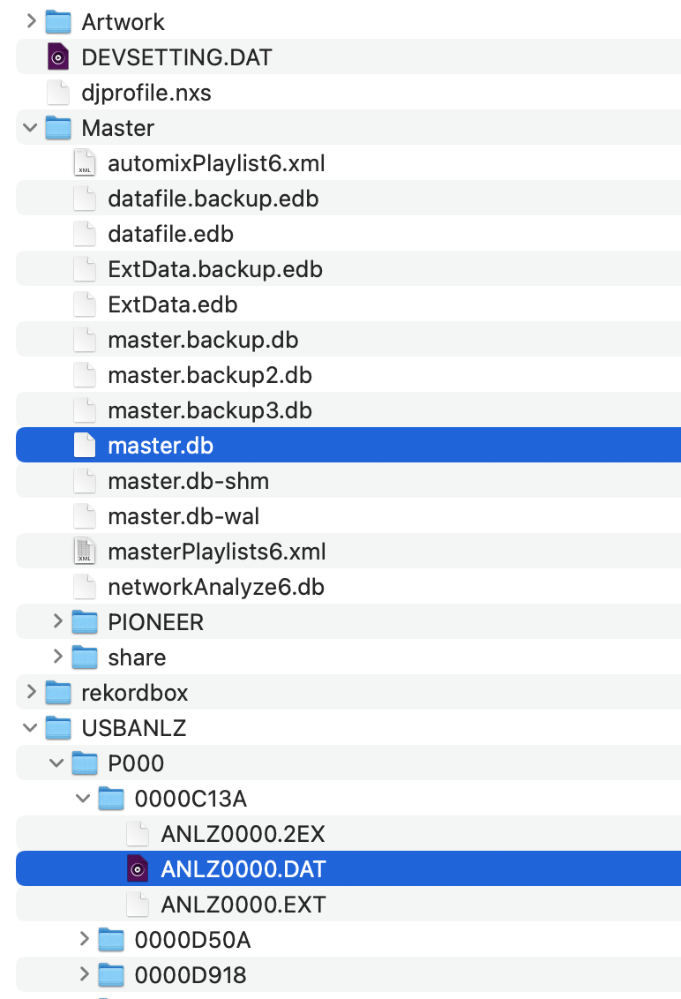
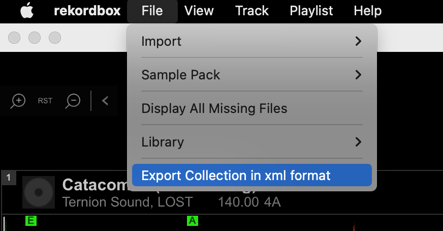
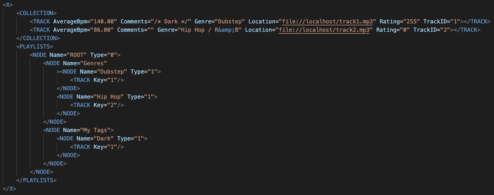
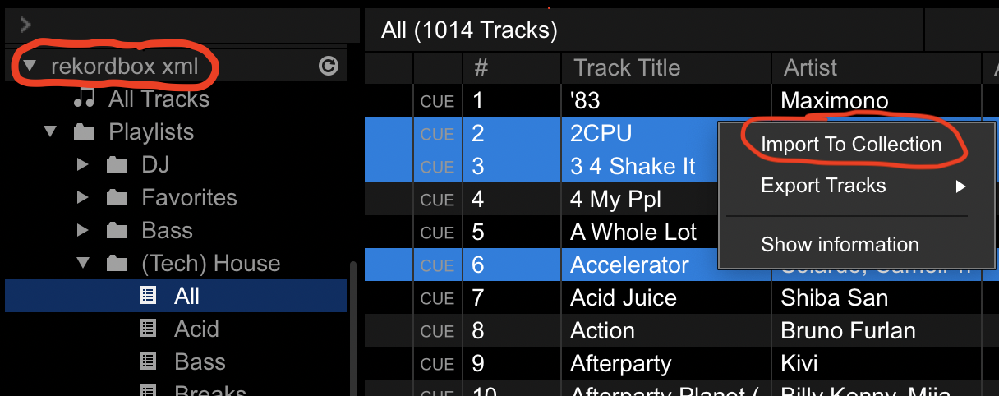

# Get to Know Your Rekordbox Collection

In this guide, we'll be looking at one of the two ways your Rekordbox Collection can be represented.

## Representations of your Collection
The native representation (for Rekordbox 6 at least) is an encrypted SQLite database stored in a `master.db` file and a cryptic hierarchy of binary files:

While it's possible to decrypt this database and perform operations on it directly, this is not conducive to sharing with peers. For this reason, DJ Tools operates on a manually exported XML file:

## A closer look at the Rekordbox XML file

As an example, we can look at the test XML packaged in the DJ Tools repo. It's been edited to be as minimal as possible:

There are two primary sections in this XML; the first is the `COLLECTION` tree which houses a `TRACK` node for every track in your collection. The second section is a `PLAYLISTS` tree which contains sub-trees for all your nested folders with playlists in them. At the leaves of the tree are `TRACK` nodes which contain a single attribute, `Key`, which serves as a lookup for `TRACK` nodes in the `COLLECTION` tree via their `TrackID` attribute.

The `TRACK` nodes in the `COLLECTION` tree contain every piece of information about your tracks: their beatgrid, hot cues, title, artist, genre, and comments tags, etc. Let's focus on one particular attribute of the `TRACK` node, the `Location`. This attribute is a string representing the path to the audio file. 

By convention, it's always prefixed with `file://localhost/` and suffixed with the absolute path to the audio file. For example, if you have an audio file located at `/Volumes/My_USB/Music/Favorites/best_song_ever.mp3`, then the `Location` attribute for its `TRACK` node will be `file://localhost/Volumes/My_USB/Music/Favorites/best_song_ever.mp3`.

For Windows users, if you have a track located at `D:\Music\Favorites\best_song_ever.mp3`, then the `Location` attribute for its `TRACK` node will be `file://localhost/D:/Music/Favorites/best_song_ever.mp3`. Take note that paths in the XML are *always* represented as posix paths using forwardslashes rather than backslashes.

Also note that, upon inspecting your own XML export, the paths in the `Location` attribute will be [escaped](https://en.wikipedia.org/wiki/Escape_character) and look more like this:

`file://localhost/Volumes/AWEEEEZY/DJ%20Music/aweeeezy/Bass/2023-03-21/Catacombs%20(VIP%20Bootleg)%20-%20Ternion%20Sound,%20LOST.mp3`

## How DJ Tools uses this XML
All of the features of the rekordbox package of DJ Tools performs reads and writes on an exported XML file. The [Shuffle Tracks in Playlists](../how_to_guides/shuffle_playlists.md) feature assigns new values to the `TrackNumber` attribute of the `TRACK` nodes appearing in the provided playlists. The [Copy Tracks From Playlists](../how_to_guides/copy_playlists.md) feature uses the `Location` attribute to copy audio files to a new destination. The [Build Playlists From Tags](../how_to_guides/collection_playlists.md) feature reads the `Genre` and `Comments` attributes to collect tracks and then manipulates the `PLAYLISTS` tree of the XML to automatically generate your desired playlist structure.

Once you've run an operation that edits the XML, you must import those tracks and / or playlists to realize the changes. To do this, select the track(s), playlist(s), or folder(s) from `rekordbox XML` section of the tree view and choose "Import To Collection" or "Import Playlist"; this will overwrite any playlists, beatgrids, hot cues, tags, etc. so make sure you know what you're doing (first make a backup by exporting a fresh XML)!:

This is the same method you use to import tracks from other user's XML files (see [this guide](../how_to_guides/sync_beatcloud.md#downloading-xml) for more details).
