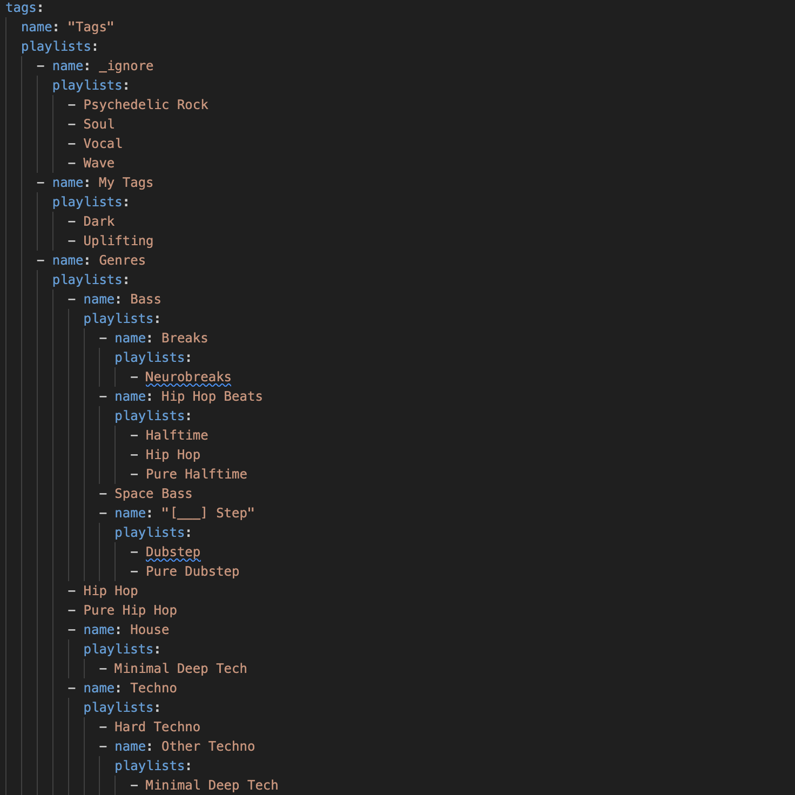
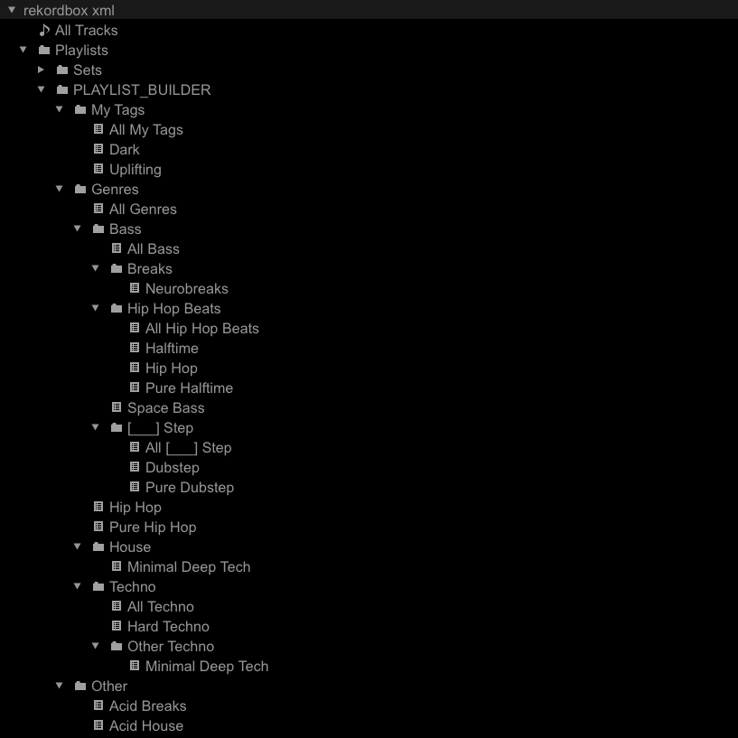

# Build Playlists From Tags

In this guide you will learn how to automatically build playlists based off of the information encoded in the various tag attributes of the tracks in your Collection.

## Prerequisites

* [Rekordbox settings](../tutorials/getting_started/setup.md#rekordbox-settings)
* [Get to Know Your Rekordbox Collection](../conceptual_guides/rekordbox_collection.md)

## Why build playlists from tags?
It's not uncommon, while mixing, to navigate playlists that contain tracks similar to the one currently playing. For most users, these playlists are painstakingly constructed to capture these similarities. For the wiser user, this process is made a little bit easier by extensive use of tagging.

If a user diligently tags their Collection using, say, the `Genre` tag, they then have the ability to search individual genres and create playlists based on the results of those searches. Unfortunately, this strategy has several shortcomings:

* The manual process of moving tracks into playlists can be both time consuming and error prone
* Having a change of heart with respect to the genre that a particular track belongs to means that that track must be removed from some existing playlist(s) and added to some different playlist(s)
* Searching, for example, "Techno" will show not only tracks that contain the word "techno" in their `Genre` tag but also any track that has *any* mention of the word "techno" associated with it (like a dubstep track whose title is "This track is not techno")

The [collection_playlists][djtools.collection.playlist_builder.collection_playlists] feature solves all of these issues! It allows the wisest of users to configure a YAML file with a specification of arbitrary folders and playlists. The playlists' names match the tags that exist in your Collection.

## How it's done

1. Configure your desired playlist structure(s) for `tags`
1. Run the command `--collection-playlists`
1. Import the `PLAYLIST_BUILDER` folder from the generated collection

## Example
Let's start by examining the pre-packaged [YAML](https://en.wikipedia.org/wiki/YAML) file [collection_playlists.yaml](https://github.com/a-rich/DJ-Tools/blob/main/djtools/configs/collection_playlists.yaml):


You can ignore the `combiner` part of the YAML for now. Although it's similar to the `tags` section, it's covered in the [Combine Playlists With Boolean Algebra](combiner_playlists.md) how-to guide.

The configuration above specifies a set of `name` folders with lists of playlists and / or folders inside of them. The leaves of this playlist tree are the actual playlists themselves named after the tag that the playlist will contain tracks for. Note that you can reference the same tag multiple times.

While not pictured above, the `playlist_builder` supports configuring the names of playlists if you'd like them to be something other than the tag used to create them.
For example, users may provide a map containing the `tag_content` field, which specifies the tag to use, and an optional `name` field to override the actual name of the playlist.
Note that if `name` is not provided, `tag_content` will be used as the playlist name.
Here's an example of overriding the name of a Hard Techno playlist to be "Techno that is hard":
```
    - tag_content: Hard Techno
      name: Techno that is hard
```

Every folder will create an implicit playlist called `All <folder name>` which recursively aggregates the tracks from all the playlists within that folder. For example, my `Techno` folder will have a playlist called `All Techno` which contains the union of tracks between `Hard Techno` and `Minimal Deep Tech`.

You may only have one tag for each playlist. If you're interested in creating playlists that combine multiple tags, check out the [Combiner](combiner_playlists.md) how-to guide.

Any tags in your Collection that are not included in the `collection_playlists.yaml` configuration file will automatically be added to either a `Other` playlist or an `Other` folder with a playlist for each tag (you can [configure this behavior](../tutorials/getting_started/configuration.md#collection-config) using `COLLECTION_PLAYLISTS_REMAINDER`).

If there are tags for which you're not interested in creating an `Other` playlist(s) for, simply add a new folder to the tree call `_ignore` and list the tags underneath of it.

During operation of the `playlist_builder`, after the `tag` playlists are constructed, optional `PlaylistFilters` are applied to enable special filtering. For example, the `HipHopFilter` looks for playlists matching the name `Hip Hop` and checks if there's a playlist called `Bass` somewhere above it. If so, then the only tracks allowed in that playlist are ones that have at least one genre tag besides `Hip Hop` and `R&B`. Conversely, if there is _not_ a parent playlist called `Bass`, then the only tracks allowed in that playlist must have exclusively `Hip Hop` (and `R&B`) genre tags. A second `PlaylistFilter` is the `MinimalDeepTechFilter` which looks for playlists matching the name `Minimal Deep Tech` and checks if there's a playlist called `House` or `Techno` somewhere above it. If so, then only tracks also containing a genre tag with the substring `House` or `Techno` is allowed in the respective playlists.

You may configure which, if any, `PlaylistFilters` you want applied using the `COLLECTION_PLAYLIST_FILTERS` option. Check the [references](../reference/collection/index.md) for the current set of implemented `PlaylistFilters`.

Once you've finalized your playlist configuration, run the following command to build the playlists:

`djtools --collection-playlists`

Now you can import the `PLAYLIST_BUILDER` folder to load these playlists into your Collection:

