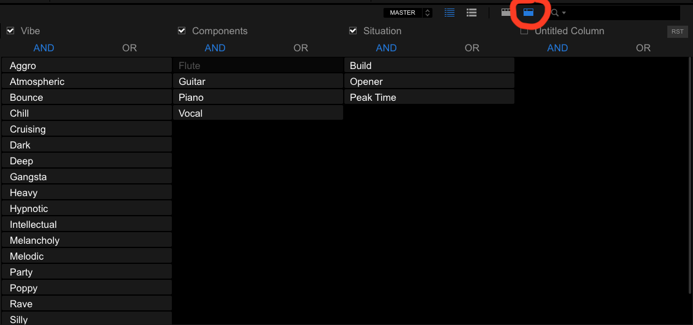
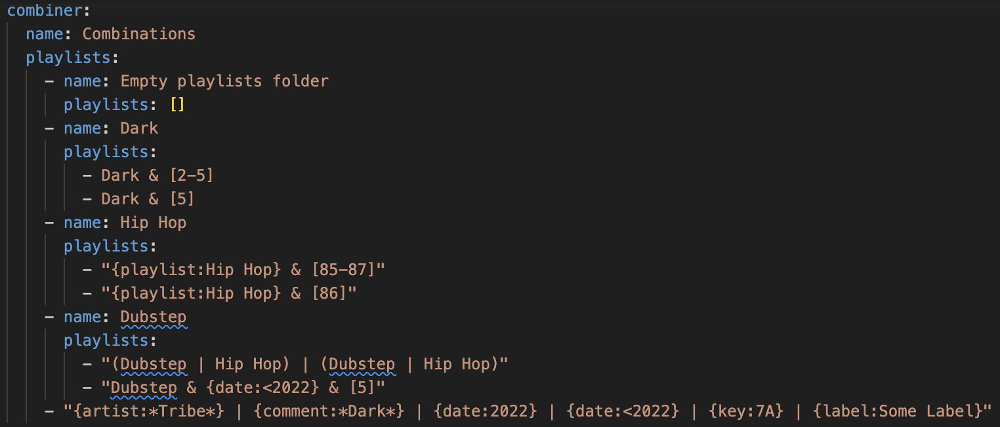
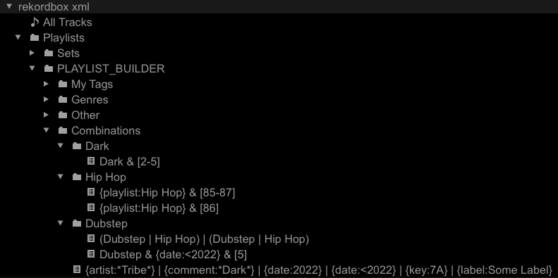

# Combine Playlists with Boolean Algebra

In this guide you will learn how to automatically build playlists based off of powerful boolean algebra expressions that apply set operations to tags, playlists, and other selections of your Collection.

## Prerequisites

* [Rekordbox settings](../tutorials/getting_started/setup.md#rekordbox-settings)
* [Get to Know Your Rekordbox Collection](../conceptual_guides/rekordbox_collection.md)
* [A light review of set theory](https://en.wikipedia.org/wiki/Set_theory#Basic_concepts_and_notation)

## Why combine playlists with boolean algebra?
It may not be commonly known, but Rekordbox already has a very elementary version of this functionality called the "Track Filter":


There are many shortcomings with the Track Filter which make it far inferior to the [Combiner][djtools.collection.helpers.build_combiner_playlists]:

1. Portability
    * can only be used on a laptop running Rekordbox (not available on XDJs, CDJs, etc.)
    * can only be used with the master database on a laptop (friends plugging in their devices lose access to this feature)
1. Operands
    * only works on `My Tags`, color, rating, key, and a maximum of 6% range from a single BPM value
1. Operators
    * can only apply `AND` and `OR` logic
    * can only apply logic to `My Tags`
    * can only apply one of these logic operators per grouping of `My Tags`

The `Combiner` solves all these issues in the following ways:

1. Portability
    * generates regular playlists which can be exported to a device for use on any system
1. Operands
    * works on any tag data that `djtools` knows of (e.g. genres, `My Tags`, etc.)
    * includes numerical selector syntax to choose arbitrary rating, BPM, and year values as well as arbitrary ranges of those values
    * includes string selector syntax to choose playlists in your Collection as well as artists, comments, dates added, keys, and record labels
    * any of the string selectors (except for `date`) support wildcard globbing with the `*` character
1. Operators
    * adds a `NOT` operator to take the set difference
    * allows you to apply logic operators to *any* of the operands, not just `My Tags`
    * allows you to construct arbitrarily complex expressions using parentheses to control the order of operations

## Syntax

* logical operators ("AND", "OR", "NOT"):
    - `&`
    - `|`
    - `~`
* string selectors (not case-sensitive):
    - `{artist:*Eprom*}`
    - `{comment:*hollaback*}`
    - `{date:2022}`
    - `{date:>2021-10-05}`
    - `{date:<=2020-05}`
    - `{date:1y}`
    - `{date:>=3m}`
    - `{date:<10w5d}`
    - `{key:7A}`
    - `{label:duploc}`
    - `{playlist: Deep House}`
* numerical selectors:
    - `[0]`
    - `[3-5]`
    - `[80]`
    - `[130-150]`
    - `[1973]`
    - `[2013-2023]`
* grouping:
    - `(`
    - `)`

### Date string selectors can take two forms:
1. ISO format date strings e.g. `2024-06-22`, `2024-06`, `2024`
2. `ymwd` (year, month, week, day) format timedelta strings e.g. `1y`, `3m2w`, `5d`

Here's how playlists can be built using the different date string selector types using the examples from above.
- `{date:2022}`: tracks added in the year 2022
- `{date:>2021-10-05}`: track added after October 5th, 2021
- `{date:<=2020-05}`: tracks added on or before May, 2020
- `{date:1y}`: tracks added exactly 1 year ago today
- `{date:>=3m}`: tracks added within the last 3 months
- `{date:<10w5d}`: tracks at least 75 days old

### Let's look at an example playlist to see how the syntax works.

Suppose we want a playlist with tracks that _all have_ the following properties:

- from the years 2000 to 2023
- and have a rating of 5
- and with BPMs in the range 130 to 150

The expression will look this:

    [2000-2023] & [5] & [130-150]

Now let's say we want a playlist with tracks that have _any one of_ the following properties:

- have a genre tag called "Jungle"
- or have another tag called "Dark"
- or come from a playlist called "New Years 1999"
- or come from the record label "Dispatch"

The playlist for this set of tracks is expressed like this:

    Jungle | Dark | {playlist: New Years 1999} | {label: Dispatch}

Now let's say we want to create a playlist using the other supported string selectors. We're also going to demonstrate the set difference operator `~` which will remove matching tracks from the resulting playlist. This subset of tracks will _all have_ the following properties:

- have at least one of the artists as "Eprom"
- and have been added to the collection after 2010
- and have the words "absolute banger" in the comments
- and not have a major musical key (using [Camelot notation](https://mixedinkey.com/harmonic-mixing-guide/))

The playlist for these tracks is written like this:

    {artist: *Eprom*} & {date:>2010} & {comment:*absolute banger*} ~ {key:*A}

Finally, let's see how we can create one master playlist from all three of these sub-expressions using groupings to ensure the proper order of operations:

    ([2000-2023] & [5] & [130-150]) |
    (Jungle | Dark | {playlist: New Years 1999} | {label: Dispatch}) |
    ({artist: *Eprom*} & {date:>2010} & {comment:*absolute banger*} ~ {key:*A})
    
I hope you see how powerful the `Combiner` can become when used with a well indexed collection!

## Templating

Once the potential of these Combiner playlists is realized, you might find your `collection_playlists.yaml` starting to become unwieldy with many nested folders of repetitive expressions.
For this reason, `djtools` supports templating out your playlist config's substructures using [Jinja](https://jinja.palletsprojects.com/en/3.1.x/).
`djtools` looks for a Jinja template located at `configs/playlist_templates/collection_playlists.j2` and uses it to build a `collection_playlist.yaml` at runtime.
With templating, I've replaced manually maintaining a 2,300 line `collection_playlists.yaml` file with a 300 line `collection_playlists.j2`!

Here's an example of my `configs` directory:
```
.
├── collection_playlists.yaml
├── config.yaml
├── playlist_templates
│   ├── collection_playlists.j2
│   └── macros.j2
└── spotify_playlists.yaml
```

I've decided to keep the patterns I commonly use in my playlists in the `macros.j2` file and import them into my `collection_playlists.js2`.
Here's what my `macros.j2` looks like:
```



name: {{ name if name else var }}
playlists:
  
  - name: {{ vibe }}
    tag_content: "{{ var }} & {{ vibe }}"
  



{%- set genres = [
    {"name": "140ish Bass", "tag": "([130-150] & {playlist:All Bass})"},
    {"name": "4/4", "tag": "({playlist:All House} | {playlist:All Techno} | {playlist:All Trance} | {playlist:Midtempo})"},
    {"name": "Breakbeat & Garage", "tag": "({playlist:All Breakbeat} | {playlist:All Garage})"},
    {"name": "DnB", "tag": "{playlist:All DnB}"},
    {"name": "Hip Hop Beats (slow)", "tag": "([6-119] & {playlist:All Hip Hop Beats})"},
    {"name": "Hip Hop Beats (fast)", "tag": "([120-999] & {playlist:All Hip Hop Beats})"},
    {"name": "Other Bass", "tag": "({playlist:All Bass} ~ [130-150] ~ {playlist:All DnB} ~ {playlist:All Hip Hop Beats})"},
    {"name": "Everything Else", "tag": "({playlist:All Bass} | {playlist:All Breakbeat} | {playlist:All Garage} | {playlist:All House} | {playlist:Midtempo} | {playlist:All Techno} | {playlist:All Trance})"}
] -%}

name: {{ name if name else var }}
playlists:
  
  - name: {{ genre.name }}
    tag_content: "{{ var }} & {{ genre.tag }}"
  
% 
```

To demonstrate how I'm using macros, I'm including a sample of my `collection_playlists.j2` -- note the use of the `|indent` filter to ensure the macros indent the content filled by the macros in order to produce valid YAML:
```


combiner:
  name: Combinations
  playlists:
    - name: Genre Vibes
      playlists:
        - name: DnB
          playlists:
            - {{ macros.Vibes("All DnB")|indent(14) }}
            - {{ macros.Vibes("Darkstep")|indent(14) }}
            - {{ macros.Vibes("Halftime")|indent(14) }}
            - {{ macros.Vibes("Jungle")|indent(14) }}
            - {{ macros.Vibes("Liquid Funk")|indent(14) }}
            - {{ macros.Vibes("Minimal DnB")|indent(14) }}
            - {{ macros.Vibes("Neurofunk")|indent(14) }}
            - {{ macros.Vibes("Techstep")|indent(14) }}
        - name: Techno
          playlists:
            - {{ macros.Vibes("All Techno")|indent(14) }}
            - {{ macros.Vibes("Pure Techno")|indent(14) }}
            - {{ macros.Vibes("Acid Techno")|indent(14) }}
            - {{ macros.Vibes("Hard Techno")|indent(14) }}
            - {{ macros.Vibes("Hardstyle")|indent(14) }}
            - {{ macros.Vibes("Industrial Techno")|indent(14) }}
            - {{ macros.Vibes("Melodic Techno")|indent(14) }}
            - {{ macros.Vibes("Minimal Deep Tech")|indent(14) }}
            - {{ macros.Vibes("Minimal Techno")|indent(14) }}
            - {{ macros.Vibes("Psytechno")|indent(14) }}
            - {{ macros.Vibes("Techno")|indent(14) }}
            - {{ macros.Vibes("Tech Trance")|indent(14) }}
    - name: Vibes
      playlists:
        - {{ macros.Genres("Aggro")|indent(10) }}
        - {{ macros.Genres("Atmospheric")|indent(10) }}
        - {{ macros.Genres("Bounce")|indent(10) }}
        - {{ macros.Genres("Dark")|indent(10) }}
        - {{ macros.Genres("Deep")|indent(10) }}
        - {{ macros.Genres("Gangsta")|indent(10) }}
        - {{ macros.Genres("Groovy")|indent(10) }}
        - {{ macros.Genres("Heavy")|indent(10) }}
        - {{ macros.Genres("Hypnotic")|indent(10) }}
        - {{ macros.Genres("Melancholy")|indent(10) }}
        - {{ macros.Genres("Melodic")|indent(10) }}
        - {{ macros.Genres("Rave")|indent(10) }}
        - {{ macros.Genres("Strange")|indent(10) }}
        - {{ macros.Genres("Uplifting")|indent(10) }}
```

## How it's done

1. Configure your desired playlists for the `Combiner` by constructing a boolean algebra expression with the syntax noted above
1. Run the command `--collection-playlists`
1. Import the `PLAYLIST_BUILDER` folder from the generated collection

## Example
As is done in the [Build Playlists From Tags](collection_playlists.md#example) how-to guide, we'll start by looking at some simple expressions configured in the pre-packaged [collection_playlists.yaml](https://github.com/a-rich/DJ-Tools/blob/main/tests/data/collection_playlists.yaml), but this time we'll focus only on the `combiner` section:

Note that the examples below are trivial ones designed to get 100% code coverage in unit tests.



The `combiner` configuration specifies a set of `name` folders with lists of playlists and / or folders inside of them. The leaves of this playlist tree are the actual playlists themselves whose names are boolean algebra expressions that use the syntax noted above to describe how different tags and selectors are to be combined to produce the final playlist of tracks. Valid expressions must contain at least two operands and must have one less operator than there are operands. 

Note that, as with the tag playlists, you may provide an override for these playlist names.
This can be really helpful since combiner playlists can otherwise have very long names.
Here's an example of configuring a playlist name override:
```
    - tag_content: "Dubstep & {date:<2022} & [5]"
      name: Pre 2022 High Energy Dubstep
```

Also note that combiner playlists, like tag playlists, support:

1. `PlaylistFilters`
1. `enable_aggregation`
1. minimum track requirements, except use the option `minimum_combiner_playlist_tracks` instead

Once you've finalized your playlist configuration, run the following command to build the playlists:

`djtools --collection-playlists`

Now you can import the `PLAYLIST_BUILDER` folder to load these playlists into your Collection:
