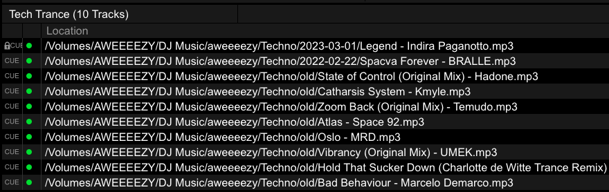
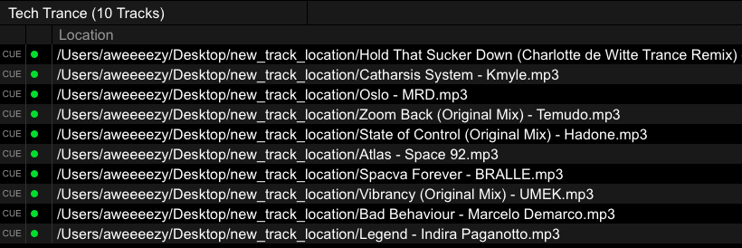

# Copy Tracks From Playlists

In this guide you will learn how to copy tracks from your playlists to a new location.

## Prerequisites

* [Rekordbox settings](../tutorials/getting_started/setup.md#rekordbox-settings)
* [Get to Know Your Rekordbox Collection](../conceptual_guides/rekordbox_collection.md)

## Why copy playlists?
Have you ever compiled a playlist for an event and wanted to make a backup USB that has specifically this playlist on it? Have you ever wanted to share a playlist with a wedding DJ you've hired or with a friend you're planning a back-to-back with?

For users who keep their music collection separate from their USB devices, achieving this is as simple as exporting to the new device; but what if your USB *is* your master database as well?

In these types of situations, you'd normally have to trace the location of the audio files for each track in your playlist(s) and copy them to the new USB. Furthermore, if you wanted the new Collection on the target USB to have the same hot cues, tags, etc., you'd have to process those tracks again on the new USB to carry that information over.

Wouldn't it be nice if you make your playlists, run a command, and get a new USB with all those audio files automatically copied to it AND a generated collection that you can import from to retrieve all the track data present in your existing Collection? That's exactly what the [copy_playlists][djtools.collection.copy_playlists.copy_playlists] feature does!

## How it's done

1. Choose the playlist or playlists whose tracks you'd like to copy
1. Determine the destination where you want all those tracks to be copied
1. Run the command `--copy-playlists` with the name(s) of the playlist(s) provided (if spaces are present in the name, you must enclose the name with quotes) and the desired destination path provided with the `--copy-playlists-destination` option
1. Import the playlists from the generated collection

## Example
In the image below, you can see that the "Tech Trance" playlist has it's tracks located across a variety of paths under `/Volumes/AWEEEEZY/DJ Music/aweeeezy/Techno/`:

Next, I run the command:

`djtools --copy-playlists "Tech Trance" --copy-playlists-destination ~/Desktop/new_track_location`

Now I can view the `location` of the tracks in the "Tech Trance" playlist in the generated collection and see that they point to the `new_track_location` directory on my desktop:

