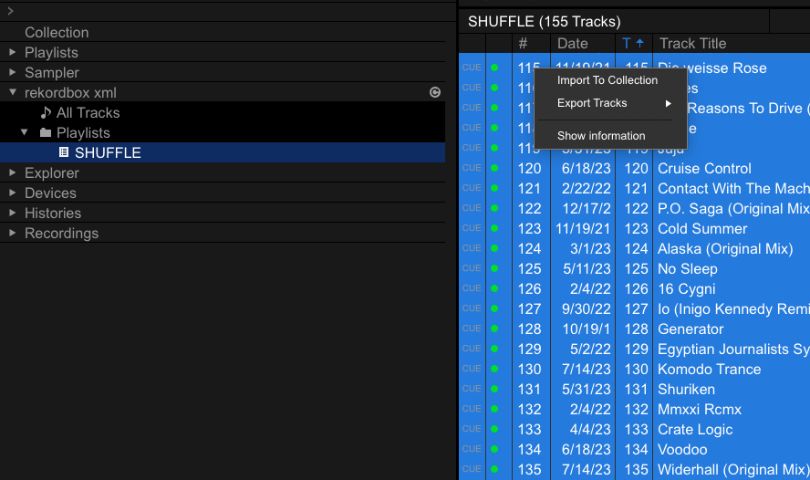

# Shuffle tracks in playlists

In this guide you will learn how to shuffle your collection's playlists.

## Prerequisites

* [Rekordbox settings](../tutorials/getting_started/setup.md#rekordbox-settings)
* [Get to Know Your Rekordbox Collection](../conceptual_guides/rekordbox_collection.md)

## Why shuffle playlists?
I find the absence of a shuffle feature for your Rekordbox playlists to be pretty strange. I have playlists, like event sets, that don't make any sense to shuffle. However, the majority of my mixing is done in an ad hoc manner, using genre-based playlists generated by the [Build Playlists From Tags](../how_to_guides/collection_playlists.md) feature.

I noticed that I kept mixing the same pairs of songs together because they catch my eye the same way each time I scan the playlists from top to bottom. It's true that any of the columns can be sorted, but there's only so much variation that can be introduced from this. For this reason, I implemented the [shuffle_playlists][djtools.collection.shuffle_playlists.shuffle_playlists] feature.

## How it's done

1. Choose the playlist or playlists whose tracks you'd like shuffled
1. Run the command `--shuffle-playlists` with the name(s) of the playlist(s) provided (if spaces are present in the name, you must enclose the name with quotes)
1. Import either the `SHUFFLE` playlist or else all of the tracks within it from the generated collection
1. Make sure you have the `Track Number` column enabled in Rekordbox and sort by it to realize the shuffling

`NOTE`: if you have multiple playlists with the same name, all of those playlists will have their tracks shuffled!

## Example
In the image below, you can see that the first 20 tracks of my "Jungle" playlist have track numbers in the set `{1, 2, 3}`:

Next, I run the command:

`djtools --shuffle-playlists Jungle`

Now I can import the tracks from the `SHUFFLE` playlist in the generated collection:

Once importing the tracks is complete, I can now view the "Jungle" playlist and see that the `Track Number` attributes have been overwritten, enabling an emulation of playlist shuffling via sorting of this column:

