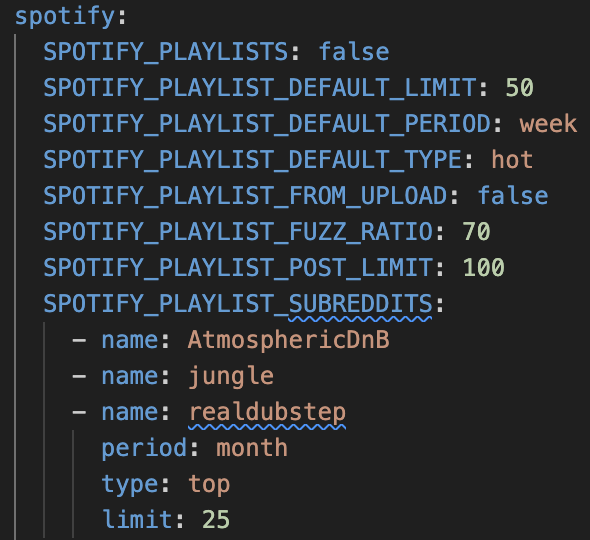

# Create Spotify Playlists From Reddit Posts

In this guide you will learn how to automatically build Spotify playlists based on the titles of submissions made to subreddits.

Note that the efficacy of this tool is dependent on whether or not submissions are links to Spotify tracks and, if not, how strictly submission titles conform to a standard of `artist name - track title` or `track title - artist name`. See the note at the bottom regarding the potential for subreddit-specific title parsers.

## Why create Spotify playlists from Reddit posts?
The idea to create a Reddit --> Spotify track scraper came from the [r/Techno](https://open.spotify.com/playlist/5gex4eBgWH9nieoVuV8hDC?si=dce5edf9edb9433d) playlist. I found this one to be a great way to gain exposure to new music and wanted to emulate it across other subreddits.

## How it's done

1. [Setup API access for Spotify and Reddit](reddit_spotify_api_access.md)
1. Configure the `AUTO_PLAYLIST_SUBREDDITS` option (see the [SpotifyConfig][djtools.spotify.config.SpotifyConfig] and [SubredditConfig][djtools.spotify.config.SubredditConfig] for more details)
1. Run the command `djtools --auto-playlist-update`

## Example
In the example below, you can see a portion of `config.yaml` which shows all of the options relating to the `--auto-playlist-update` feature.

The `AUTO_PLAYLIST_SUBREDDITS` option is where you configure the subreddits from which you'd like to build Spotify playlists from. It accepts a list of `SubredditConfig` objects. The minimum attribute required for each of the `SubredditConfig` objects is the `name` attribute which is a case-insenstive exact match of the subreddit. The other attributes are as follows:

* `limit` [default=50]: the maximum number of tracks allowed in the playlist before the least recently added tracks are removed
* `period` [default=week]: the interval for which to pull Reddit submissions over `{all, day, hour, month, week, year}`
* `type`: [default=hot]: the sorting filter to apply for the subreddit `{controversial, hot, new, rising, top}`

Each of the above (`name` not included) has an associated `AUTO_PLAYLIST_DEFAULT_*` option which will be applied in the absence of specification for any individual `SubredditConfig` object.

The remaining `--auto-playlist-update` related options are as follows:

* `AUTO_PLAYLIST_FUZZ_RATO` [default=70]: the minimum required Levenshtein similarity between the parsed submission title and the `track title - artist name` of Spotify search results for the result to be added to the playlist
* `AUTO_PLAYLIST_POST_LIMIT`[default=100]: the maximum number of submissions results from a subreddit query
* `AUTO_PLAYLIST_UPDATE` [default=false]: the flag to trigger the execution of this feature

Once your options are configured as desired, you can run the following command to populate the playlists:

`djtools --auto-playlist-update`

Note that only one result (the one with the highest Levenshtein similarity that is above `AUTO_PLAYLIST_FUZZ_RATIO`) will be added to the playlist for each submission.

Also note that a [naive submission title parser][djtools.spotify.helpers.parse_title] is used unanimously for all subreddits. In the future, it would be helpful if an abstract interface for submission title parsing was defined and implementations could be sub-classed and configured inside the individual `SubredditConfig` objects.
