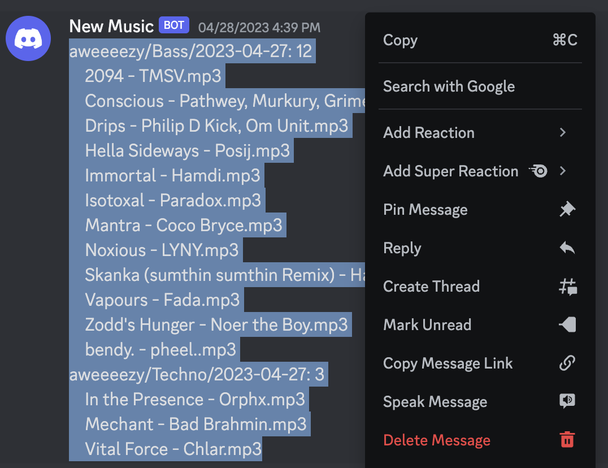
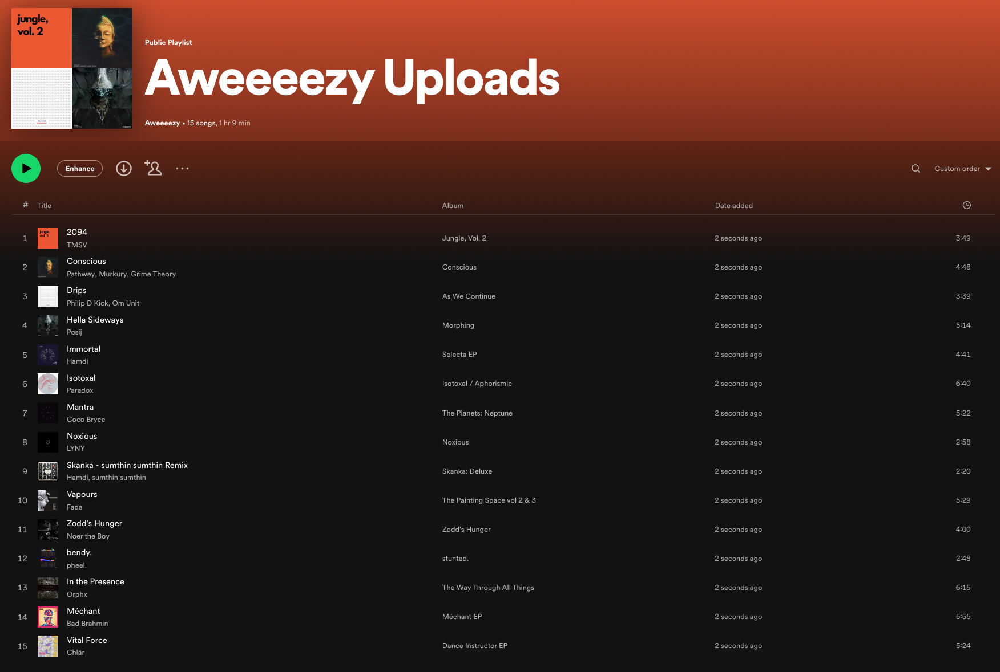

# Create Spotify Playlists From Other Users' Uploads

In this guide you will learn how to automatically build Spotify playlists based on the Discord webhook output triggered by a user's music upload.

Note that the addition of tracks to a Spotify playlist is done in a best effort manner. If users upload tracks that either (a) do not exist on Spotify or (b) have filenames that do not adhere to the [suggested standard](../conceptual_guides/file_standardization.md#filenames), they will not be found when searching Spotify.

## Prerequisites

* [Setup Object Storage For Syncing Files](setup_object_storage.md)
* [Setup API access for Spotify and Reddit](reddit_spotify_api_access.md)
* Setup a Discord server and [generate a webhook](../tutorials/getting_started/setup.md#discord-webhook) for a channel on that server
* A user must have uploaded music triggering the webhook to post a message to your Discord server

## Why create Spotify playlists from other users' uploads?
You're probably using DJ Tools to manage a shared track collection with friends who have a similar taste in music. Despite this, we all have our own style and don't necessarily want to indiscriminately sync every track that every other user syncs to the Beatcloud.

The purpose of this feature is to allow you to build a Spotify playlist from the tracks a user uploads so that they can be previewed and filtered for compatibility with your mixing style. Once this playlist has been filtered down a bit, you can then run the `--download-spotify-playlist` option to sync just the tracks that remain in the playlist.

## How it's done
1. Ensure that other users of your Beatcloud instance have the `discord_url` option set to this webhook URL; otherwise you won't
    - be alerted when they upload music
    - have the fancy formatted text output that's required to use this feature
1. Once another user runs the [upload music](sync_beatcloud.md#uploading-music) command, a message containing a file tree of their upload results will be posted to your server
1. Copy the complete text from that message to your system clipboard
1. Run the command `djtools --spotify-playlist-from-upload`

## Example
In the image below, I'm copying the Discord webhook output from one of my own uploads:


The top-level directory in the file tree *should* correspond with a username; it's this value that's used to name the playlist `<Username> Uploads`. In this example, a playlist called `Aweeeezy Uploads` will be created since the top-level directory is `aweeeezy`.

With the webhook output copied to my clipboard I now run the following command:

`djtools --spotify-playlist-from-upload`

As you can see in the output below, all of the tracks from the upload were able to be found on Spotify:
```
Matched 2094 - TMSV to 2094 - TMSV
Matched Conscious - Pathwey, Murkury, Grime Theory to Conscious - Pathwey, Murkury, Grime Theory
Matched Drips - Philip D Kick, Om Unit to Drips - Philip D Kick, Om Unit
Matched Hella Sideways - Posij to Hella Sideways - Posij
Matched Immortal - Hamdi to Immortal - Hamdi
Matched Isotoxal - Paradox to Isotoxal - Paradox
Matched Mantra - Coco Bryce to Mantra - Coco Bryce
Matched Noxious - LYNY to Noxious - LYNY
Matched Skanka - sumthin sumthin Remix - Hamdi, sumthin sumthin to Skanka (sumthin sumthin Remix) - Hamdi, sumthin sumthin
Matched Vapours - Fada to Vapours - Fada
Matched Zodd's Hunger - Noer the Boy to Zodd's Hunger - Noer the Boy
Matched bendy. - pheel. to bendy. - pheel.
Matched In the Presence - Orphx to In the Presence - Orphx
Matched Méchant - Bad Brahmin to Mechant - Bad Brahmin
Matched Vital Force - Chlär to Vital Force - Chlar
15 new tracks added
"Aweeeezy Uploads": https://open.spotify.com/playlist/1hsPD6IpuTzJLkXwxlpxTF
```

Finally, the below image shows the automatically generated playlist:

