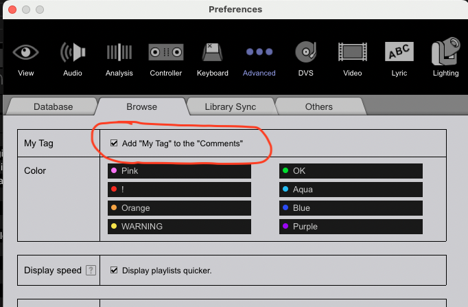

# Setup

## Python
The DJ Tools library requires a minimum version of Python 3.9. As always, when working with a Python project, you're going to want to create a [virtual environment](https://docs.python.org/3/tutorial/venv.html); [Pyenv](https://github.com/pyenv/pyenv) is really nice but if you insist on doing a system-wide Python installation then proceed with the following instructions:

- Mac installation: `brew install python@3.9`
- Linux installation: `sudo apt install python3.9`
- Windows installation: [Windows releases](https://www.python.org/downloads/windows/)

## DJ Tools
1. Run `pip install "djtools[accelerated]"` to install the DJ Tools library
    - To install DJ Tools without the accelerated computation for Levenshtein distance (might be difficult to install the binaries for non-technical users), run `pip install djtools`
    - You can install the pre-release version with `pip install djtools --pre`
    - If you want to restrict the version being installed to not include, say, the next minor version's beta release then you can do so like `pip install djtools<2.5.0 --pre`
    - Note that installing with the `--pre` flag will also install pre-release versions for all dependencies which may cause breakage, in that case you can target specific pre-release versions like this `pip install djtools==2.4.1-rc9`
1. Confirm your installation works by running `djtools`
1. [Optional] link the `configs` directory of the installation to a user-friendly location for easy editing of your config files: `djtools --link-configs path/to/new/location/`
1. Edit your configuration files to support your usage needs ([see here for more details](configuration.md))

## AWS S3 API compliant object store
If you are using any of the following features, you are required to have an AWS S3 API compliant cloud storage account setup (see [this guide](../../how_to_guides/setup_object_storage.md) for more details):

* [Sync files with the Beatcloud](../../how_to_guides/sync_beatcloud.md)
* [Sync tracks from Spotify playlists](../../how_to_guides/sync_spotify.md)
* [Check the Beatcloud for tracks in Spotify playlists or local directories](../../how_to_guides/check_beatcloud.md)

## Spotify user account
If you are using any of the following features, you are required to have a Spotify account to add playlists to:

* [Create Spotify playlists from Reddit posts](../../how_to_guides/spotify_playlist_from_reddit.md)
* [Create Spotify playlists from other users' uploads](../../how_to_guides/spotify_playlist_from_upload.md)

## Spotify and Reddit APIs
If you are using any of the following features, you are required to have a registered Spotify API application (see [this guide](../../how_to_guides/reddit_spotify_api_access.md) for more details):

* [Create Spotify playlists from other users' uploads](../../how_to_guides/spotify_playlist_from_upload.md)
* [Sync tracks from Spotify playlists](../../how_to_guides/sync_spotify.md)
* [Check the Beatcloud for tracks in Spotify playlists or local directories](../../how_to_guides/check_beatcloud.md) (if Spotify playlists are configured)

Additionally, if you're using any of the following features, you are required to have a registered Reddit API application (see [this guide](../../how_to_guides/reddit_spotify_api_access.md) for more details):

* [Create Spotify playlists from Reddit posts](../../how_to_guides/spotify_playlist_from_reddit.md)

## Discord webhook
If you are using any of the following features, you are required to have a Discord server with a registered webhook integration (see [this guide](https://support.discord.com/hc/en-us/articles/228383668-Intro-to-Webhooks) for more details):

* [Create Spotify playlists from other users' uploads](../../how_to_guides/spotify_playlist_from_upload.md)
* [Sync files with the Beatcloud](../../how_to_guides/sync_beatcloud.md#uploading-music)
    * `NOTE`: this isn't strictly required but:
        1. [Create Spotify playlists from other users' uploads](../../how_to_guides/spotify_playlist_from_upload.md) isn't possible without it 
        1. It's really useful to automatically notify other users when and what tracks are uploaded

## FFmpeg
If you're using any of the features which leverage the `pydub` package (`normalize_audio`, `process_recording`, etc.), and you're exporting in any format other than `wav` or `raw`, you'll need to install [FFmpeg](https://www.ffmpeg.org/) to support those codecs. For more info about installing FFmpeg, you can look at the note about it on the `pydub` [README](https://github.com/jiaaro/pydub#getting-ffmpeg-set-up).

## Rekordbox settings

### Writing "My Tag" data to the Comments field
In order for "My Tag" data to be accessible to the [Build Playlists From Tags](../../how_to_guides/collection_playlists.md) and [Combine Playlists With Boolean Algebra](../../how_to_guides/combiner_playlists.md) features, that data must be written to the Comments field. There's no need to clear pre-existing data from the Comments; just ensure that this option is checked in the settings:

### Importing tracks from XML
Make sure you have made the `rekordbox.xml` database visible under `Preferences > View > Layout`:

Also ensure you have the proper XML file (whichever XML has data you're wanting to import) selected under `Preferences > Advanced > Database > rekordbox xml`:

